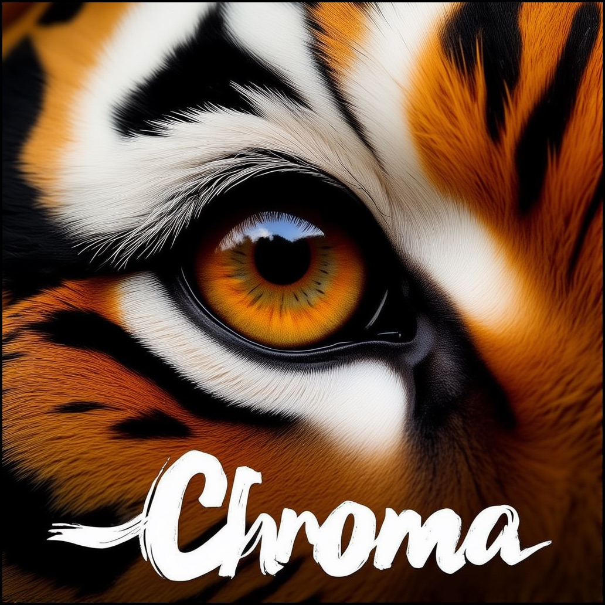

MLX-Chroma
====

Chroma implementation in MLX. The implementation is ported from Author's Project
[flow](https://github.com/lodestone-rock/flow.git)、 [ComfyUI](https://github.com/comfyanonymous/ComfyUI) and [MLX-Examples Flux](https://github.com/ml-explore/mlx-examples/tree/main/flux)

The model weights are downloaded directly from the Hugging Face Hub.
[https://huggingface.co/lodestones/Chroma](https://huggingface.co/lodestones/Chroma)


    
Image generated using Chroma in MLX 
**Prompt:** 'Extreme close-up photograph of a single tiger eye, direct frontal view. The iris is very detailed and the pupil resembling a dark void. The word \"Chroma\" is across the lower portion of the image in large white stylized letters, with brush strokes resembling those made with Japanese calligraphy. Each strand of the thick fur is highly detailed and distinguishable. Natural lighting to capture authentic eye shine and depth.' 
**Negative Prompt:** 'low quality, ugly, unfinished, out of focus, deformed, disfigure, blurry, smudged, restricted palette, flat colors'

Installation
------------

The dependencies are minimal, namely:

- `huggingface-hub` to download the checkpoints.
- `regex` for the tokenization
- `tqdm`, `PIL`, and `numpy` for the scripts
- `sentencepiece` for the T5 tokenizer
- `datasets` for using an HF dataset directly

You can install all of the above with the `requirements.txt` as follows:

    pip install -r requirements.txt


Usage
---------

You can use the following command to generate an image, using `--output` to specify the storage location of the image, defaulting to `out.png`.
If you set `--download-hf True`, the model will be downloaded from HuggingFace. Or you can put the model in the `./models/` directory and run it directly

from https://huggingface.co/lodestones/Chroma download chroma-unlocked-v*.safetensors **Rename and Save** in 
./models/chroma/chroma.safetensors

from https://huggingface.co/black-forest-labs/FLUX.1-dev download text_encoder_2, tokenizer_2 and ae.savetensors
./models/t5/text_encoder_2
./models/t5/tokenizer_2
./models/vae/ae.savetensors

```shell
python txt2image.py --image-size 1024x1024 \
    --neg-prompt 'low quality, ugly, unfinished, out of focus, deformed, disfigure, blurry, smudged, restricted palette, flat colors' \
    --step 28\
    --download-hf True \
    --seed 666\
    --skip-cfg-steps 0 \
    --cfg 4 \
    --output "test.png" \
    --verbose \
    'Extreme close-up photograph of a single tiger eye, direct frontal view. The iris is very detailed and the pupil resembling a dark void. The word \"Chroma\" is across the lower portion of the image in large white stylized letters, with brush strokes resembling those made with Japanese calligraphy. Each strand of the thick fur is highly detailed and distinguishable. Natural lighting to capture authentic eye shine and depth.'
```


For more parameters, please use the `--help` command to view.

```shell
python txt2image.py --help
```

Inference
---------

Inference in this example is similar to the stable diffusion example. The
classes to get you started are `ChromaPipeline` from the `chroma` module.

```python
import mlx.core as mx
from chroma import ChromaPipeline

# This will download all the weights from HF hub
chroma = ChromaPipeline("chroma")

# Make a generator that returns the latent variables from the reverse diffusion
# process
latent_generator = chroma.generate_latents(
    prompt="Extreme close-up photograph of a single tiger eye, direct frontal view. The iris is very detailed and the pupil resembling a dark void. The word \"Chroma\" is across the lower portion of the image in large white stylized letters, with brush strokes resembling those made with Japanese calligraphy. Each strand of the thick fur is highly detailed and distinguishable. Natural lighting to capture authentic eye shine and depth.",
    neg_prompt="",
    num_steps=28,
    latent_size=(64, 64),  # 512x512 image
)

# The first return value of the generator contains the conditioning and the
# random noise at the beginning of the diffusion process.
conditioning = next(latent_generator)
(
    x_T,                # The initial noise
    x_positions,        # The integer positions used for image positional encoding
    t5_conditioning,    # The T5 features from the text prompt
    t5_positions,       # Integer positions for text (normally all 0s)
    neg_txt,
    neg_txt_ids
) = conditioning

# Returning the conditioning as the first output from the generator allows us
# to unload T5 and clip before running the diffusion transformer.
mx.eval(conditioning)

# Evaluate each diffusion step
for x_t in latent_generator:
    mx.eval(x_t)

# Note that we need to pass the latent size because it is collapsed and
# patchified in x_t and we need to unwrap it.
img = chroma.decode(x_t, latent_size=(64, 64))
```

The above are essentially the implementation of the `txt2image.py` script
except for some additional logic to quantize and/or load trained adapters. One
can use the script as follows:

```shell
python txt2image.py \
    --download-hf True \
    --image-size 512x512 \
    'Extreme close-up photograph of a single tiger eye, direct frontal view. The iris is very detailed and the pupil resembling a dark void. The word \"Chroma\" is across the lower portion of the image in large white stylized letters, with brush strokes resembling those made with Japanese calligraphy. Each strand of the thick fur is highly detailed and distinguishable. Natural lighting to capture authentic eye shine and depth.'

```